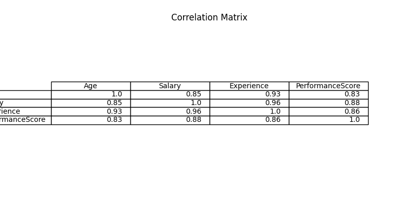
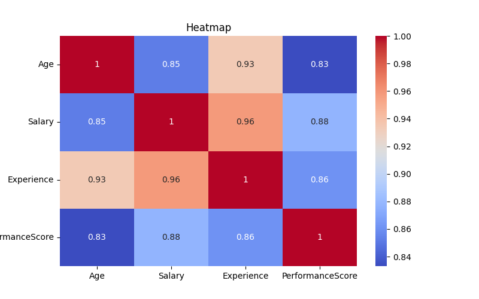

# Data Visualization with Seaborn: Correlations and Heatmaps

## Project Objective

The objective of this project is to understand and implement data visualization techniques using Seaborn. The project focuses on Correlation Analysis and Heatmap Visualization to identify relationships, patterns, and trends within a dataset.

---

# Introduction

This project demonstrates Data Visualization using Seaborn with a focus on Correlations and Heatmaps. Correlation analysis is used to measure relationships between numerical variables, while Heatmaps provide a visual representation of those relationships using color-coded patterns. These techniques help identify trends, patterns, and associations within the dataset.

---

# Technologies Used

* Python
* Pandas
* NumPy
* Matplotlib
* Seaborn

---

# Topics Covered

* Seaborn Fundamentals
* Correlation Analysis
* Correlation Matrix
* Heatmap Visualization
* Data Interpretation

---

# Dataset

The dataset contains employee information including Age, Salary, Experience, and Performance Score.

---

# Project Workflow

1. Import Required Libraries
2. Create and Load Dataset
3. Explore Dataset Information
4. Perform Correlation Analysis
5. Generate Correlation Matrix
6. Create Heatmap Visualization
7. Analyze Results
8. Draw Insights and Conclusions

---

# Import Libraries

```python
import pandas as pd
import numpy as np
import matplotlib.pyplot as plt
import seaborn as sns
```

---

# Correlation Analysis

Correlation is used to measure the relationship between numerical variables in the dataset.

```python
correlation = df.select_dtypes(include=np.number).corr()

print(correlation)
```

---

# Heatmap Visualization

A Heatmap is used to visualize the correlation matrix using colors.

```python
plt.figure(figsize=(8,5))

sns.heatmap(
    correlation,
    annot=True,
    cmap="coolwarm"
)

plt.title("Heatmap")
plt.show()
```

---

# Visualization

## Correlation Matrix



## Heatmap



---

# Key Insights

* Correlation helps identify relationships between numerical variables.
* Positive correlation indicates variables increase together.
* Negative correlation indicates variables move in opposite directions.
* Heatmaps provide a visual representation of the correlation matrix.
* Color intensity helps identify strong and weak relationships quickly.
* Experience and Salary show a positive relationship.
* Performance Score generally increases with Experience.

---

# Conclusion

This project demonstrates Data Visualization with Seaborn through Correlation Analysis and Heatmap Visualization. Correlations help measure relationships between variables, while Heatmaps provide a clear visual representation of those relationships. These techniques are useful for understanding patterns, trends, and data relationships in exploratory data analysis.
